# **Adaptive Relationships Between Avian Morphology And Climate**

## **1. Introduction**

Adaptation simply refers to the evolutionary process by which populations change traits to better survive and reproduce in a specific environment. These adaptations are typically behavioral, physiological, or morphological. While behavioral traits describe how individuals act and physiological traits explain how internal systems function, morphological traits refer to the body structure. Morphological variation involves changes in the size, color, or shape of the body and limbs, which directly affect the organism’s survival. 

Driven by a research interest in evolutionary biology and a personal fascination with birds, this project is designed to explore how avian morphology adapts to different environmental conditions. Combining a global avian trait dataset (AVONET) with world climate records (WorldClim), the project aims to reveal possible correlations between morphological traits and climatic conditions. 

The project is expected to identify an inverse relationship between body size and temperature, as suggested by Bergmann’s rule. This is because larger body sizes help preserve internal body temperature due to a lower surface area to volume ratio. Similarly, shorter limbs help minimize heat loss, known as Allen's rule. Therefore, an inverse relationship between limb size and temperature is expected. In addition, since precipitation determines the food and habitat resources available, it is expected to influence body and limb proportions. Temperature seasonality is also examined, since annual fluctuations in climate force organisms to adapt to both extremes or temporarily migrate to more favorable habitats. 

Furthermore, since selection pressures are not limited to climate, the project also investigates physiological and behavioral variables. Factors such as habitat, migratory behavior, diet, and lifestyle are expected to have an effect on morphology. For example, habitat and lifestyle could act on limb proportions, migratory behavior could specifically affect wing size and shape, and diet could specifically influence beak size.

## **2. Methodology**

> [!NOTE]
> For sections 2.1 and 2.2, refer to [this Python notebook](Data/Data_Preparation.ipynb) for details.

### **2.1. Data Structure**

#### **2.1.1. AVONET**

AVONET is a publicly available database released with the publication titled “AVONET: morphological, ecological and geographical data for all birds” by Tobias et al. (2022). The database is a compilation of functional trait data for all birds, including morphological measurements, ecological variables, and geographic location. It includes measurements from 90020 individuals of 11009 bird species around the world and summarizes the data as species averages in different taxonomic formats. For this project, the BirdLife format is used, given in CSV format. 

The morphological traits measured are beak dimensions, wing dimensions, tarsus length, and body mass. The ecological variables recorded include habitat, migration, trophic level, and primary lifestyle. Information on geographic location is given as the minimum and maximum latitude, midpoint latitude and longitude, as well as range size.

#### **2.1.2 WorldClim**

WorldClim is an open-access database of high-resolution global climate data. The data are derived from measurements from weather stations across the world and are summarized as standard monthly variables and also bioclimatic variables that are most relevant to biological processes. There are 19 bioclimatic variables regarding the temperature and precipitation. The data are given in different spatial resolutions, and for this project, selected bioclimatic variables with 10-minute resolution are used. The database is Raster Data, given in GeoTIFF format, in which every pixel of the digital image corresponds to a climate value. 

### **2.2. Data Preparation**

First, the AVONET dataset is filtered to eliminate the unused variables. The following columns are kept:

- Morphological Traits: 
    - Mass
    - Beak Length
    - Tarsus Length
    - Tail Length
    - Wing Length
    - Hand-Wing Index (HWI)
- Ecological Variables: 
    - Habitat
    - Trophic Level
    - Trophic Niche
    - Primary Lifestyle
    - Migration
- Geographical Information (for adding the climate data):
    - Centroid Longitude
    - Centroid Latitude 

Next, the rasterio library is used to extract the selected bioclimatic variables corresponding to the centroid longitude and latitude of each species. The following bioclimatic variables are added to the filtered AVONET dataset:

- BIO1: Annual Mean Temperature
- BIO4: Temperature Seasonality (Standard Deviation × 100)
- BIO5: Maximum Temperature of the Hottest Month
- BIO6: Minimum Temperature of the Coldest Month
- BIO12: Annual Mean Precipitation

### **2.3. Exploratory Data Analysis and Hypothesis Testing**

#### **2.3.1. Data Distribution**

The distribution of each variable is evaluated for normality based on skewness and kurtosis, since the Shapiro-Wilk test is overly sensitive with large sample sizes. While skewness is used as a measure of the symmetry of the distribution, kurtosis is used to measure the sharpness of the peak. For this project, the criteria for normal distribution are defined as both skewness and kurtosis values falling between -1 and 1. 

The morphological data are highly right-skewed for all five traits. For mass, wing length, and HWI, log-transformation is applied to approach a normal distribution. However, for tarsus length and beak length, the assumption of normal distribution is rejected due to high kurtosis even after log-transformation. The morphological data are also evaluated for normality when grouped based on the ecological variables, for example, the distribution of mass within each habitat group. However, none of the traits are normally distributed across ecological groups.

For minimum, maximum, and mean temperature, the data are highly left-skewed. However, normalization is intentionally not applied to these variables. This is because temperature does not follow multiplicative scaling; for example, 20 °C is not twice as hot as 10 °C. Therefore, applying logarithmic or exponential transformations could distort the physical and biological relevance. Consequently, the assumption of normal distribution is rejected for these variables. For precipitation, square root transformation is applied to approach a normal distribution. 

#### **2.3.2. Climatic Variables**

> [!NOTE]
> For this section, refer to [this Python notebook](1_EDA_Climatic.ipynb) and [this Python notebook](2_EDA_Climatic.ipynb) for details.

The selected morphological traits are tested against minimum, maximum, and mean temperature to assess correlations, using Spearman's rank correlation coefficient. Mass is additionally tested against precipitation, using the Pearson correlation coefficient, given the normal distributions.

#### **2.3.3. Ecological Variables**

> [!NOTE]
> For this section, refer to [this Python notebook](3_EDA_Ecological.ipynb) for details.

All morphological traits are first grouped based on habitat types (Open, Closed, Aquatic), migratory behaviors (Sedentary, Partial, Migratory), and trophic levels (Herbivore, Omnivore, Carnivore). All the selected traits are first tested using the Kruskal–Wallis test to assess the differences in distributions, followed by Dunn’s test to determine the groups that differ.

### **2.4. Machine Learning**

#### **2.4.1. Random Forest Regression**

> [!NOTE]
> For this section, refer to [this Python notebook](4_Random_Forest.ipynb) for details.

A random forest regression model is built for each morphological trait, combining the climatic and ecological variables. To improve the predictive power, both variable sets are expanded. In addition to the previously used temperature and precipitation, temperature seasonality is included as a climatic variable. The trophic level is replaced by the trophic niche, with 10 distinct dietary specializations. Instead of grouping the habitats into broad categories, 11 specific habitat types are used to preserve the variance. The primary lifestyle is added as a new feature, with five categories of locomotory niches: Aerial (flying), Insessorial (perching), Terrestrial (walking), Aquatic (swimming), and Generalist (not specialized).

The ecological variables are converted into numerical variables via one-hot encoding. The data is split into training (80%) and testing (20%) sets to build the model. To prevent overfitting, several thresholds are applied to the model; the number of trees is limited to 100, with a maximum of 10 branches and a minimum of 5 samples in each leaf. Feature importance is used to quantify the predictive power of each variable on a certain morphological trait. Based on the proportion of variance explained by each variable, it is concluded which factors are more controlling in avian morphology. 

#### **2.4.2. Principal Component Analysis (PCA)**

> [!NOTE]
> For this section, refer to [this Python notebook](5_PCA.ipynb) for details.

PCA is performed to reduce the morphological traits into a few dimensions. The data is first standardized for each trait, including tail length that is not included in hypothesis testing, to equally contribute to the analysis. Initially, a full PCA is run to determine the number of principal components to explain a sufficient amount of variance. As a result, it is noticed that the first two principal components, PC1 and PC2, account for nearly 85% of the total variance (Figure 1). PC1 represents the overall body size, accounting for all the size measures almost equally. PC2 represents the wing shape, heavily based on the HWI (Figure 2). Based on these two components, a two-dimensional morphospace is visualized for all the birds. The clusters are identified to conclude how climatic and ecological variables relate to the overall morphology. 

    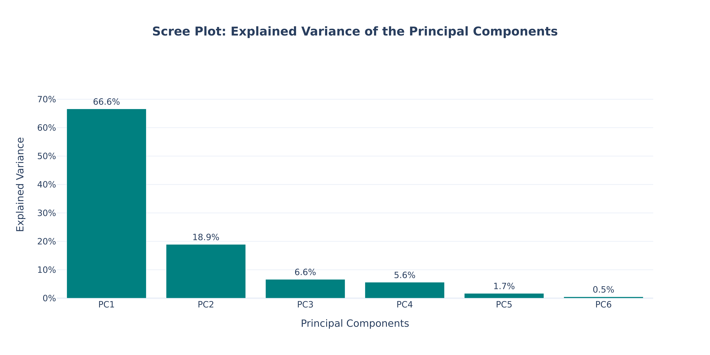
  

    <b>Figure 1:</b> Scree Plot of the full PCA
  

    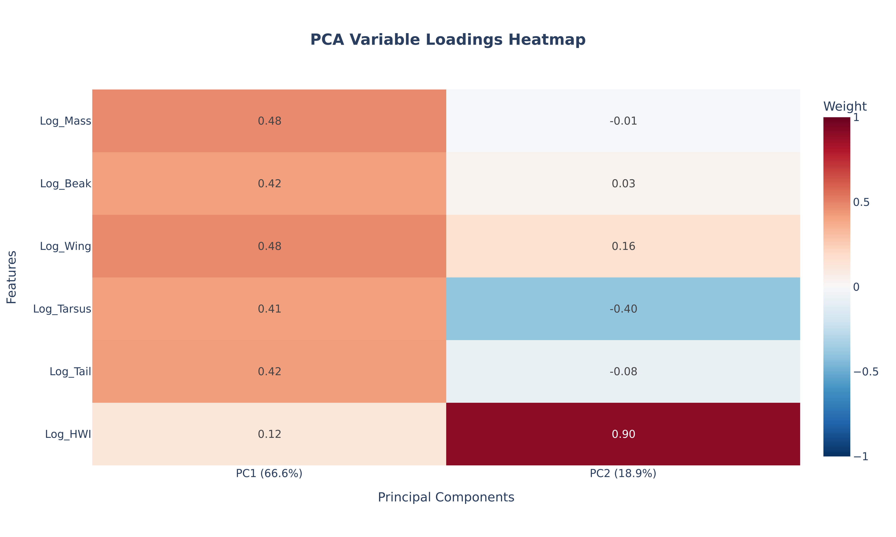
  

    <b>Figure 2:</b> Variable Loadings Heatmap for PC1 and PC2
  

## **3. Results**

### **3.1. Climatic Factors**

While the found correlations are statistically significant, they are much weaker than expected. Starting with body mass, the strongest relationship is the negative correlation between mass and minimum temperature (ρ = -0.035, p < 0.001) (Figure 3). However, this correlation weakens when compared with average temperature and loses its negative direction for maximum temperature. As for precipitation, the negative correlation is stronger (r = -0.064, p < 0.001) (Figure 4). Overall, the data reveals a weak association between colder, drier climates and slightly greater body mass, but it does not apply for maximum temperature.

    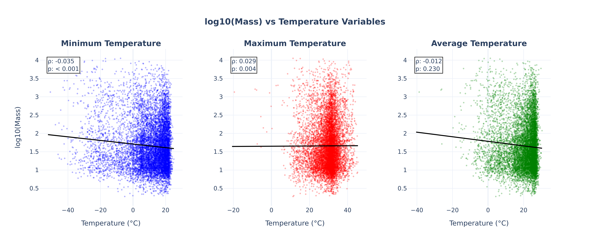
  

    <b>Figure 3:</b> Correlation between Body Mass and Temperature Variables
  

    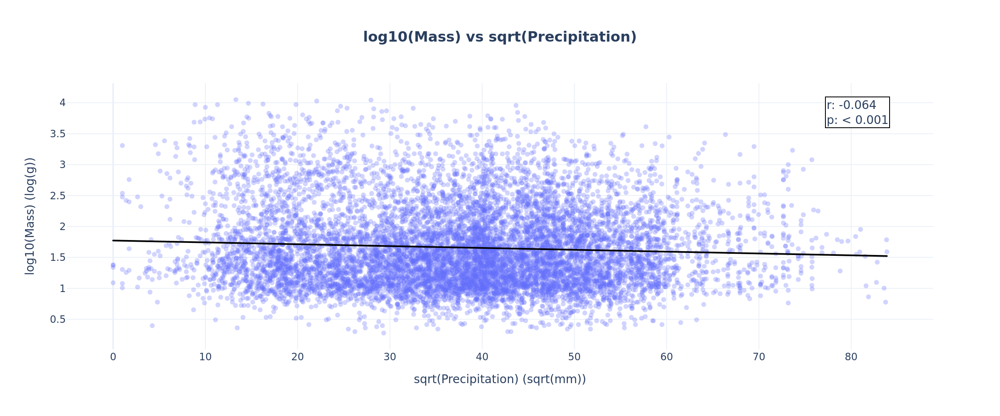
  

    <b>Figure 4:</b> Correlation between Body Mass and Precipitation
  

Between tarsus length and temperature, the negative correlation is stronger and more consistent than that of body mass (Figure 5). The negative correlation with minimum temperature is almost four times stronger (ρ = -0.121, p < 0.001), and unlike mass, it remains negatively correlated even with maximum temperature (ρ = -0.042, p < 0.001). Thus, the data indicates that birds in colder climates tend to have longer legs. 

    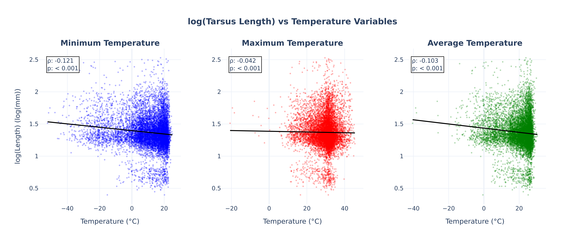
  

    <b>Figure 5:</b> Correlation between Tarsus Length and Temperature
  

Unlike body mass and tarsus length, beak length shows positive correlations with temperature (Figure 6). Similarly, with precipitation, beak length shows a positive correlation (ρ = 0.050, p < 0.001) (Figure 7). Therefore, these findings reveal a trend where birds in warmer and wetter climates exhibit slightly longer beaks.

    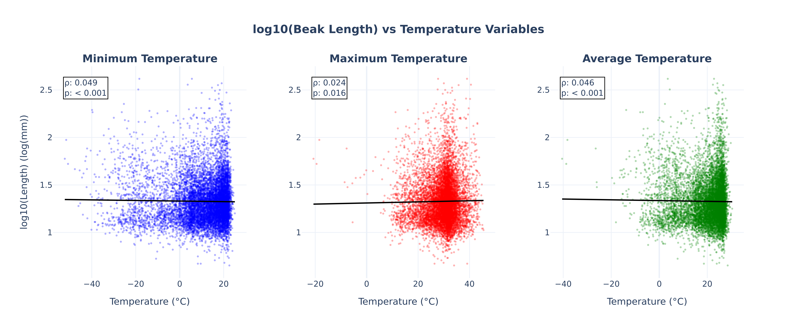
  

    <b>Figure 6:</b> Correlation between Beak Length and Temperature
  

    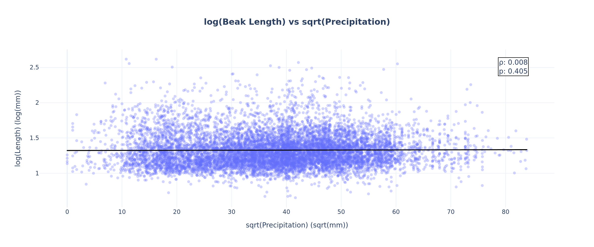
  

    <b>Figure 7:</b> Correlation between Beak Length and Precipitation
  

Wing length is also negatively correlated with minimum and average temperatures, consistent with body mass and tarsus length. However, similar to body mass, the correlation shifts toward a positive direction when compared to maximum temperature. Overall, excluding higher temperature extremes, the data suggests that birds in colder climates have slightly longer wings. As for the HWI, the trend is similar, where the correlation is positive only for maximum temperature (Figure 9).

    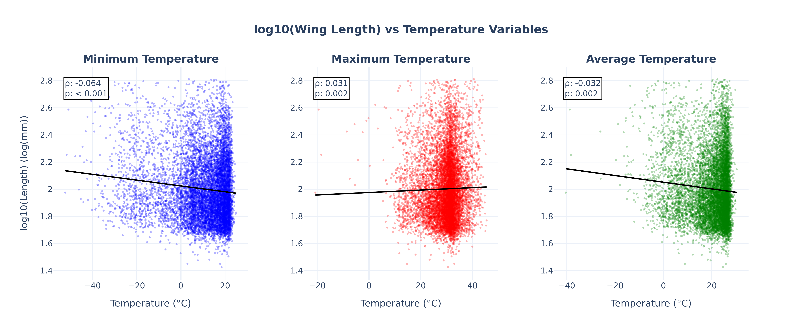
  

    <b>Figure 8:</b> Correlation between Wing Length and Temperature
  

    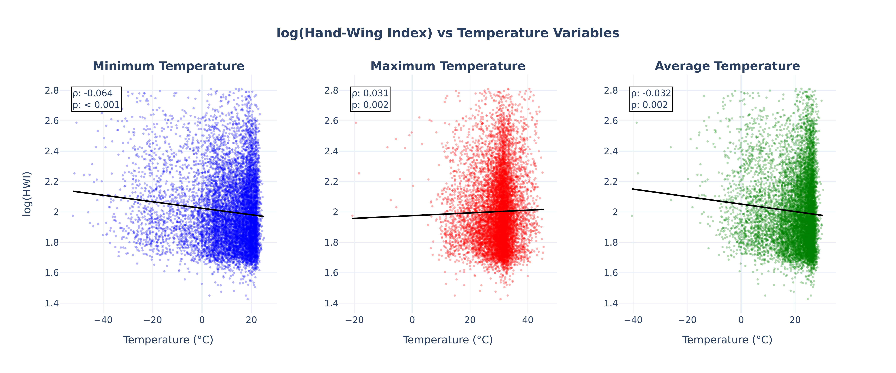
  

    <b>Figure 9:</b> Correlation between HWI and Temperature
  

### **3.2. Ecological Factors**

> [!NOTE]
> Interactive versions of all the plots of this section can be visualized on [this website](https://emrekisacik.github.io/Avian-Morphology-and-Climate/).

#### **3.2.1. Hypothesis Testing**

Starting with body mass, there is a significant relationship between mass and habitat group (H = 612.6, p < 0.001) (Figure 10). In aquatic habitats, birds are significantly heavier. In contrast, birs in closed and open habitats have smaller body mass. As for migration, the differences between categories are statistically less significant (H = 97, p < 0.001), and the overall magnitude of these differences is relatively small (Figure 11).

    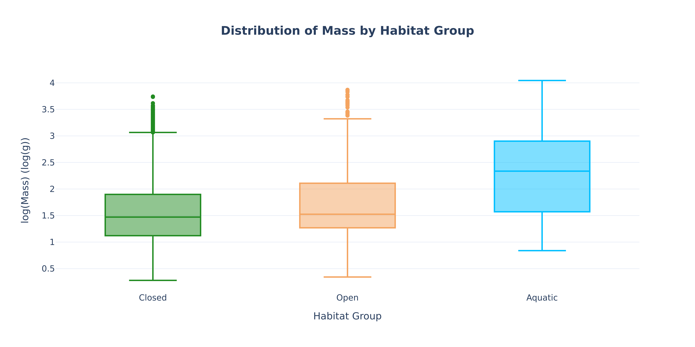
  

    <b>Figure 10:</b> Distribution of Mass by Habitat Group
  

 

    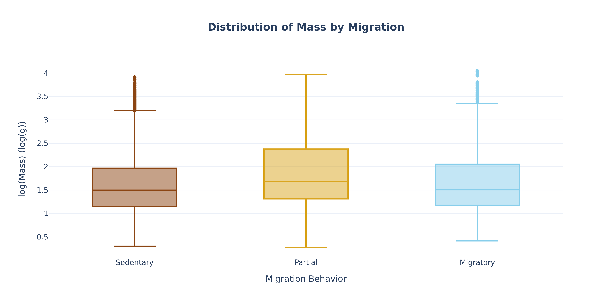
  

    <b>Figure 11:</b> Distribution of Mass by Migratory Behavior
  

Regarding tarsus length, hypothesis testing indicates that birds in aquatic habitats tend to have longer legs compared to closed and open habitats (H = 574, p < 0.001), a trend similar to body mass (Figure 12).  

    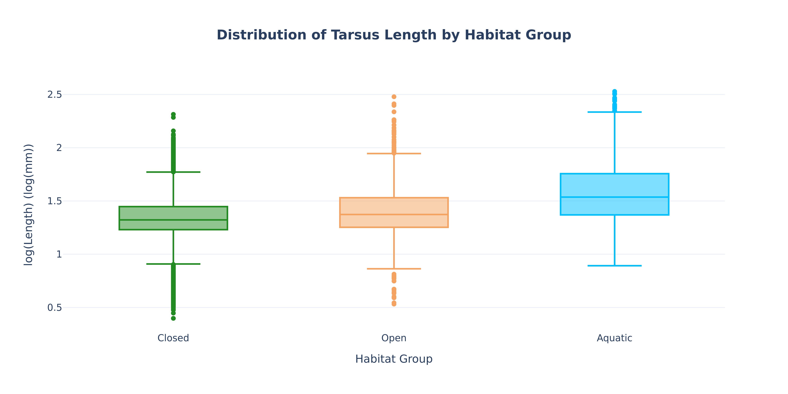
  

    <b>Figure 12:</b> Distribution of Tarsus Length by Habitat Group
  

 

As for beak length, again, birds in aquatic habitats tend to have longer beaks, compared to closed and open habitats (H = 636, p < 0.001) (Figure 13). 

    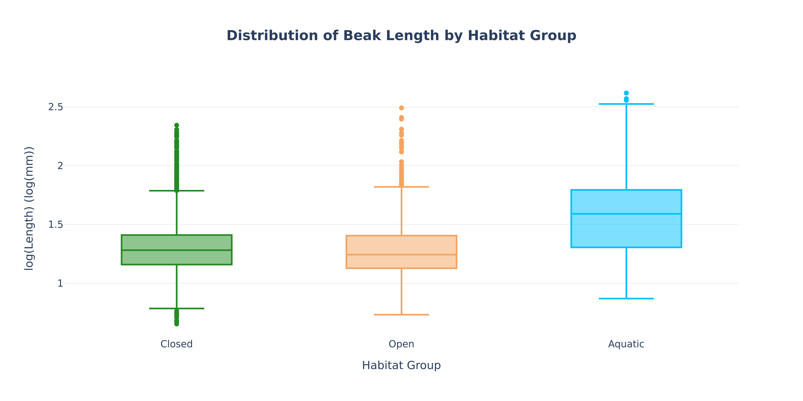
  

    <b>Figure 13:</b> Distribution of Beak Length by Habitat Group
  

 

Looking at wing length, the findings are again similar to body mass. Aquatic habitats are associated with the longest wings (F = 544, p < 0.001) (Figure 14). As for migration, the differences between categories are statistically less significant (H = 145, p < 0.001), and the overall magnitude of these differences is relatively small (Figure 15). 

    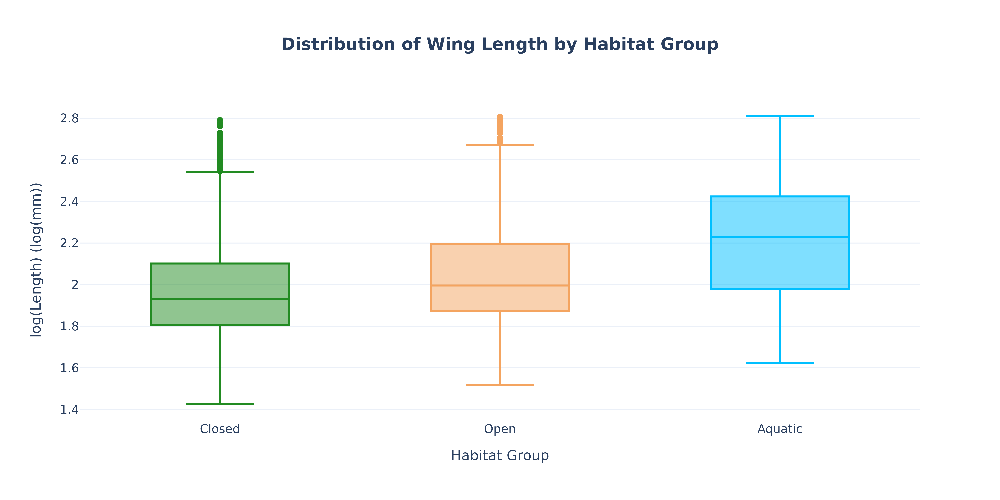
  

    <b>Figure 14:</b> Distribution of Wing Length by Habitat Group
  

 

    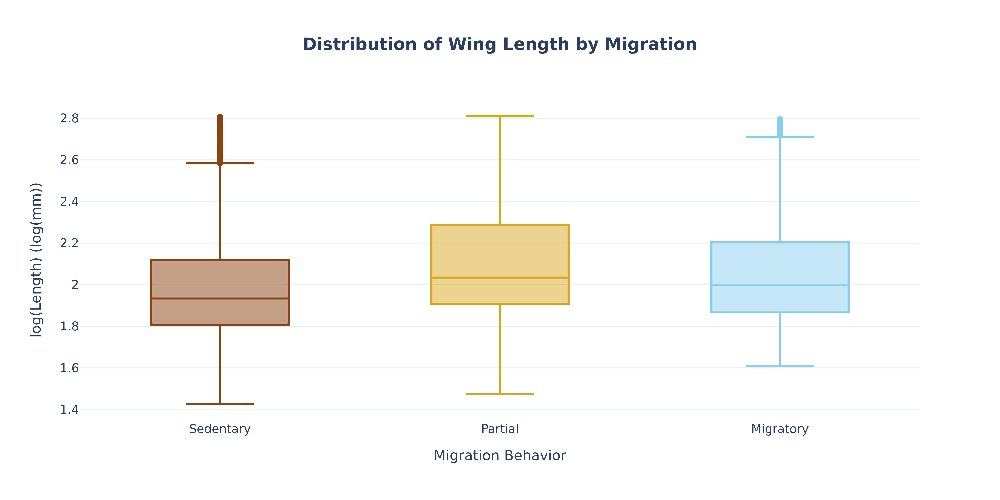
  

    <b>Figure 15:</b> Distribution of Wing Length by Migratory Behavior
  

 

Finally, regarding the HWI, the identified relationships are slightly different. Hypothesis testing reveals stronger relationships. The HWI of different habitat groups more significantly differ (H = 876, p < 0.001), where the lowest HWI in closed habitats and the highest HWI in aquatic habitats (Figure 16). As for migration, the relationship is the most significant (H = 1009, p < 0.001), where sedentary birds have the lowest HWI while the migrants have the highest HWI (Figure 17). 

    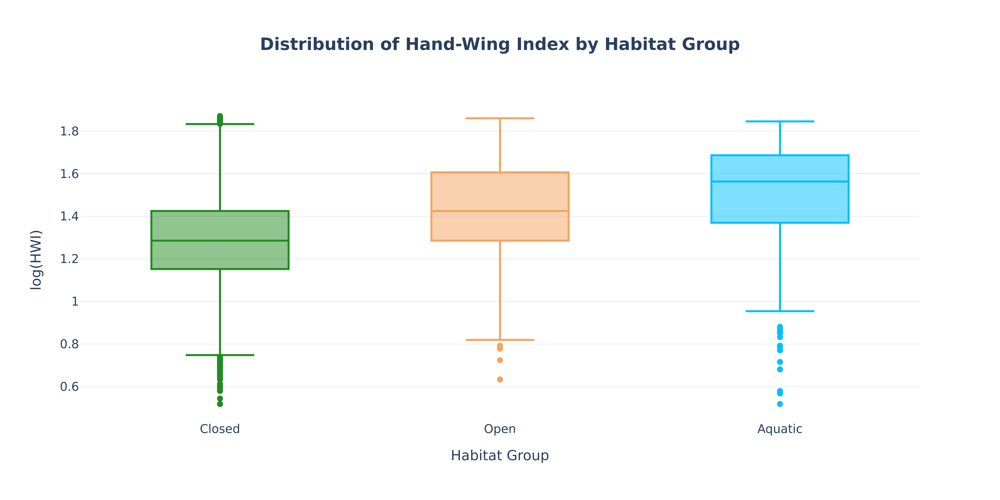
  

    <b>Figure 16:</b> Distribution of HWI by Habitat Group
  

 

    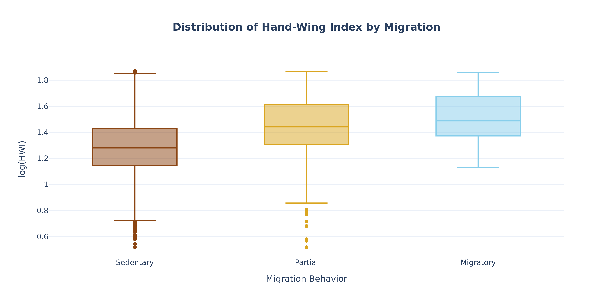
  

    <b>Figure 17:</b> Distribution of HWI by Migratory Behavior
  

 

#### **3.2.2. Random Forest Regression**

The regression model explains nearly half of the variation in body mass (R² = 0.542), and identifies trophic niche as a key variable associated with mass, contributing 61% to the model's overall importance (Figure 18). Scavengers are associated with the largest median masses, followed by herbivores and predators (Figure 19). Birds that feed on fruits (Frugivore), seeds (Granivore), insects (Invertivore), and nectar (Nectarivore) are consistently linked to the smaller body masses. Additionally, the model attributes 19% importance to primary lifestyle as a predictor of mass. Within this category, birds with aquatic lifestyles have the greatest masses, while those with aerial lifestyles are associated with the lightest bodies (Figure 20).

    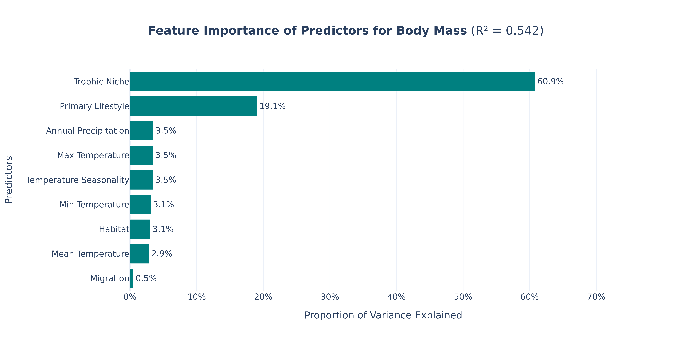
  

    <b>Figure 18:</b> Feature Importance for Body Mass Prediction
  

 

    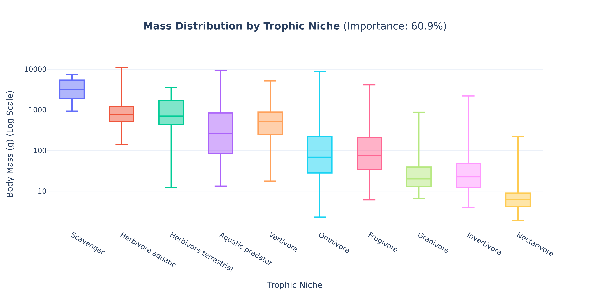
  

    <b>Figure 19:</b> Distribution of Mass by Trophic Niche
  

 

    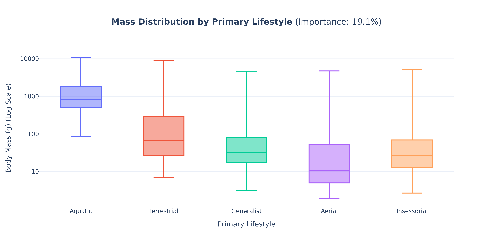
  

    <b>Figure 20:</b> Distribution of Mass by Primary Lifestyle
  

 

Likewise, the model explains more than half of the variation in tarsus length (R² = 0.617), and attributes 59% importance to trophic niche and 28% to primary lifestyle (Figure 21), with a hierarchy consistent with the one of body mass (Figures 22 and 23).

    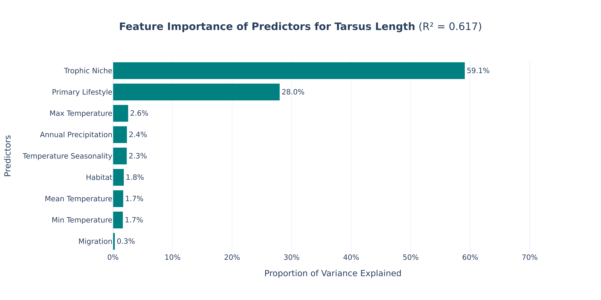
  

    <b>Figure 21:</b> Feature Importance for Tarsus Length Prediction
  

 

    
  

    <b>Figure 22:</b> Distribution of Tarsus Length by Trophic Niche
  

 

    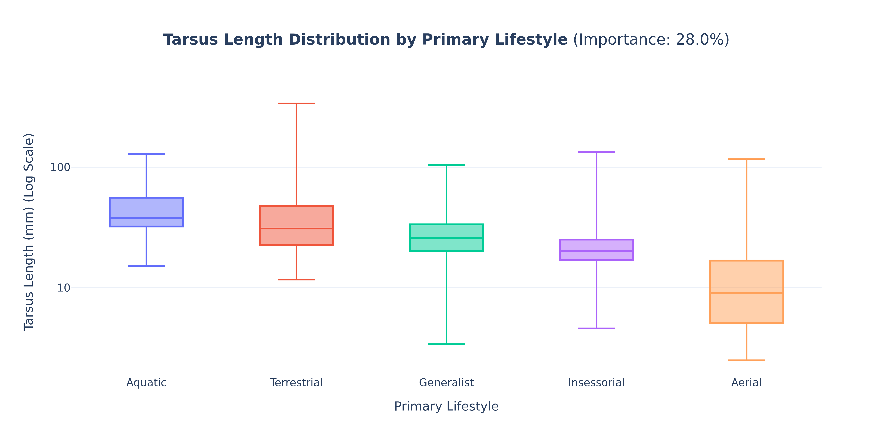
  

    <b>Figure 23:</b> Distribution of Tarsus Length by Primary Lifestyle
  

 

For beak length, the model fails to explain the majority of the variation (R² = 0.384), and attributes 54% importance to trophic niche (Figure 24), with a slightly different hierarchy (Figure 25).

    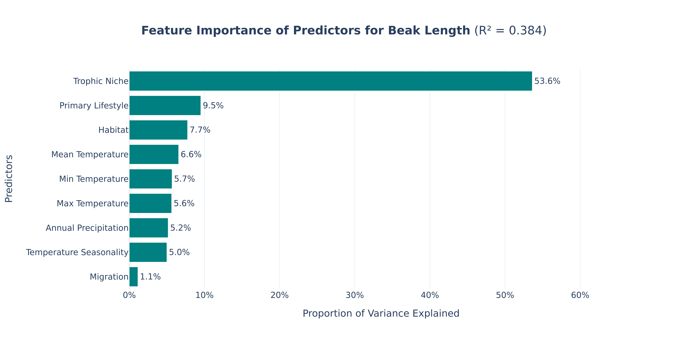
  

    <b>Figure 24:</b> Feature Importance for Beak Length Prediction
  

 

    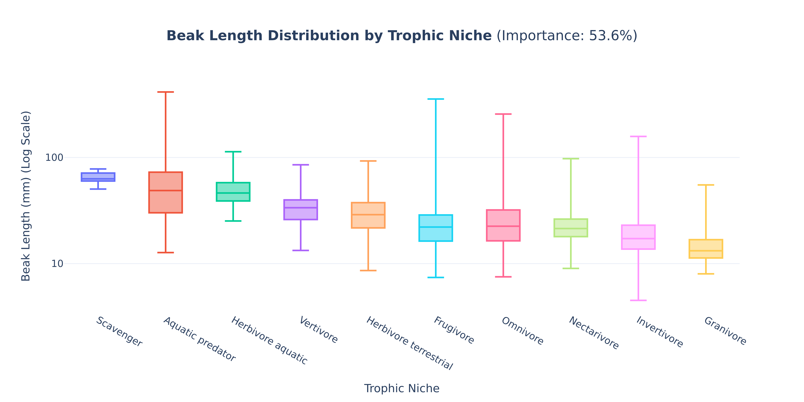
  

    <b>Figure 25:</b> Distribution of Tarsus Length by Trophic Niche
  

 

For wing length, the model explains almost half of the variation (R² = 0.464), and again identifies trophic niche and primary lifestyle as two most important variables, with 62% and 16% feature importances, respectively (Figures 26, 27 and 28). 

    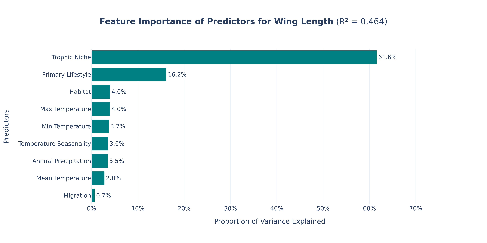
  

    <b>Figure 26:</b> Feature Importance for Wing Length Prediction
  

 

    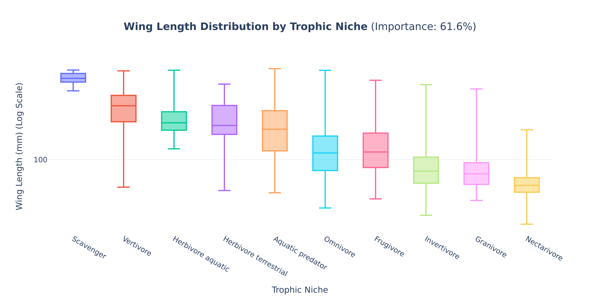
  

    <b>Figure 27:</b> Distribution of Wing Length by Trophic Niche
  

 

    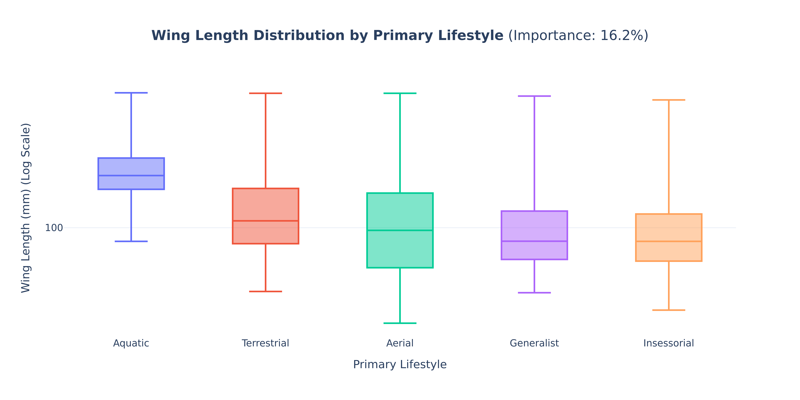
  

    <b>Figure 28:</b> Distribution of Wing Length by Primary Lifestyle
  

 

Lastly, the model explains nearly half of the variation in the HWI (R² = 0.521), but prioritizes primary lifestyle with 45% importance (Figure 29), where aerial birds have the highest HWI (Figure 30). This is followed by trophic niche with 22% importance, where nectarivores have the highest HWI (Figure 31).

    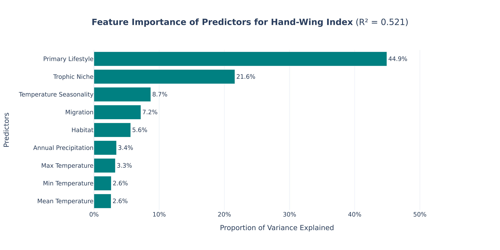
  

    <b>Figure 29:</b> Feature Importance for HWI Prediction
  

 

    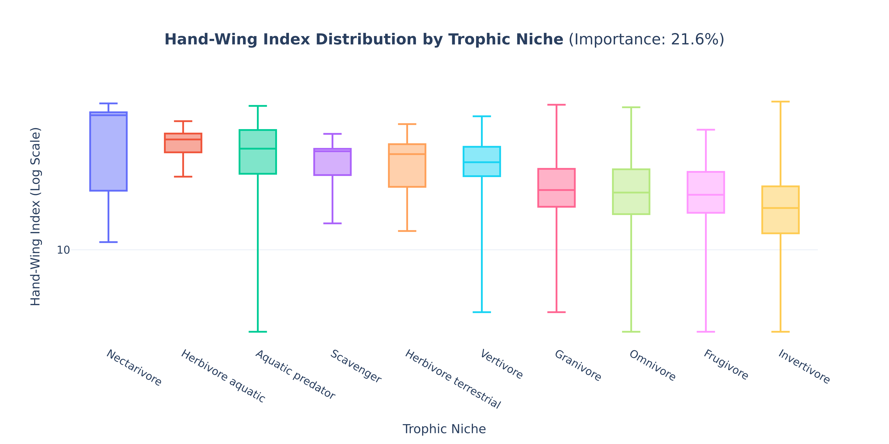
  

    <b>Figure 30:</b> Distribution of HWI by Trophic Niche
  

 

    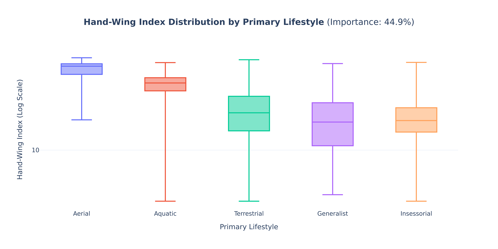
  

    <b>Figure 31:</b> Distribution of HWI by Primary Lifestyle
  

#### **3.2.3. Principal Component Analysis (PCA)**

> [!NOTE]
> Turning on/off the clusters from [this website](https://emrekisacik.github.io/Avian-Morphology-and-Climate/) is highly encouraged to better explore the morphospace since some clusters overlap.

First, the resulting morphospace is color-coded based on habitat (Figure 32). Consistent with hypothesis testing, the aquatic habitats (Coastal, Marine, Riverine, and Wetland) cluster toward higher PC1 values, translating to larger overall body sizes. On the other hand, the closed habitats (Forest, Woodland, and Shrubland) mostly overlap toward lower PC1 values, indicating smaller body sizes. As for the PC2, most habitat show a broad distribution.

When color-coded by migratory behavior, the morphospace reveals that PC1 exhibits a broad and overlapping distribution across all categories (Figure 33). However, for PC2, both migratory and partial behaviors show a distinct overlap toward higher values, demonstrating more pointed wings. 

When color-coded by primary lifestyle, the clusters are more well-defined (Figure 34). Aerial birds form a distinct cluster at low PC1 and high PC2, representing smaller body sizes and more pointed wings. Aquatic birds occupy the higher-middle range for both PC1 and PC2, meaning larger body sizes and relatively pointed wings. The remaining lifestyle categories show high overlap throughout the morphospace.

When color-coded by trophic niche, the clusters are consistent with hypothesis testing (Figure 35). Herbivores and predators (Herbivore Terrestial, Herbivore Aquatic, Aquatic Predator, and Scavenger) show significant overlap toward higher PC1 values, reflecting their larger structural body sizes. In contrast, the groups previously identified as smaller (Invertivore, Frugivore, Granivore, and Nectarivore) form distinct clusters toward the lower PC1 values. 

    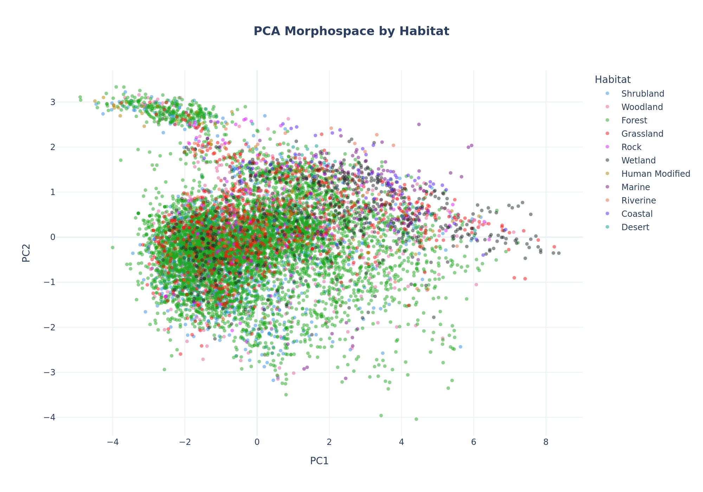
  

    <b>Figure 32:</b> PCA Morphospace by Habitat
  

    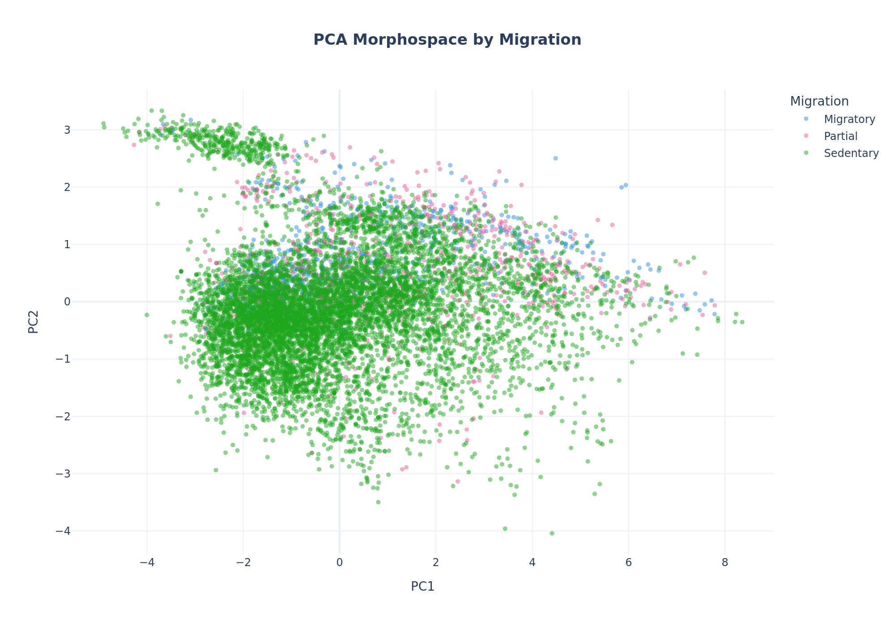
  

    <b>Figure 33:</b> PCA Morphospace by Migratory Behavior
  

    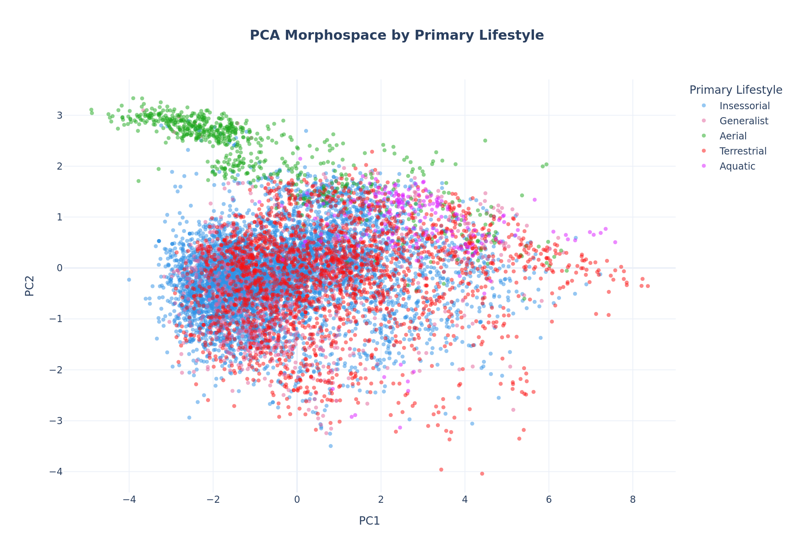
  

    <b>Figure 34:</b> PCA Morphospace by Primary Lifestyle
  

    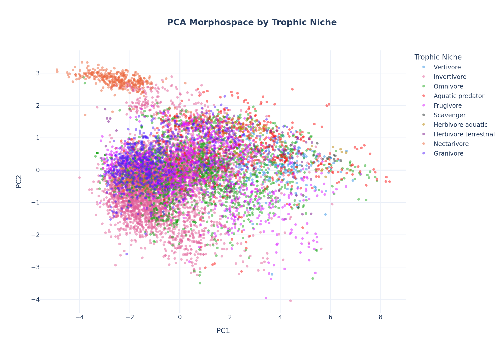
  

    <b>Figure 35:</b> PCA Morphospace by Trophic Niche
  

## **4. DISCUSSION** 

DISCUSS THE BIOLOGICAL INTERPRETATIONS HERE!!!
